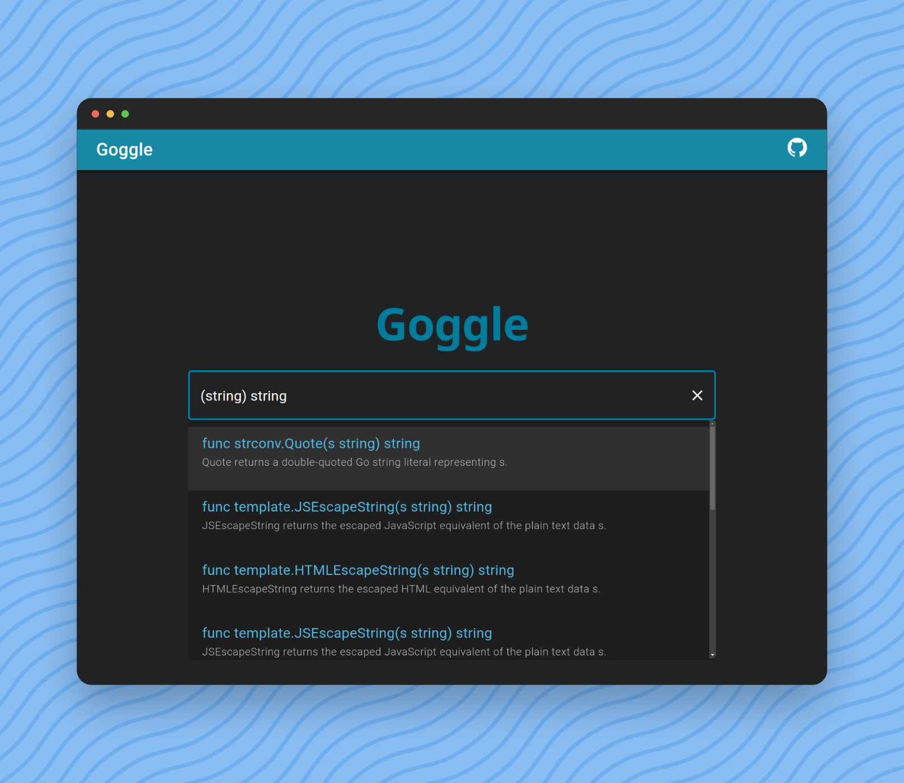

<h1 align="center">Goggle 🥽</h1>
<p align="center">Search your api through types, with speed </p>

## Overview

Type-directed search engine like [hoogle](https://github.com/ndmitchell/hoogle) but for [Go](https://go.dev/)

## Try Goggle now!

Try Goggle for yourself! You can now visit [here](https://abiriadev.github.io/goggle/) to see Goggle in action.

## Demo



## Query

You can type query to search and filter results.

The most simplest form is just Go's standard function definition.

```go
func length(s string) int
```

But we can omit a function name, to retrieve results whose name does not match with `length`.

```go
func (s string) int
```

We can omit a `func` keyword too.

```go
(s string) int
```

Finally, we can omit argument names.

```go
(string) int
```

### Query syntax definition

```ebnf
Type = Primitives | SliceType | PointerType | identifier .
Primitives = "bool" | Int | UInt | "float32" | "float64" | "complex64" | "complex128" .
Int = "int" | "int8" | "int16" | "int32" | "int64" .
UInt = "uint" | "uint8" | "uint16" | "uint32" | "uint64" | "uintptr" .

SliceType = "[" "]" Type .

Parameters = "(" [ Type { "," Type } ] ")" .
Query = [ "func" ] [ identifier ] Parameters [ Type ] .
```

## TODO

-   [ ] Index
    -   [x] Portable index file
    -   [ ] Index popular packages
-   [ ] Incremental search
-   [ ] Frontend
    -   [ ] Standalone result view
    -   [x] Link to pkg.go.dev
    -   [x] Brief description
    -   [ ] Syntax hightlighting for search result
    -   [ ] Use dedicated search bar component
-   [ ] Query
    -   [ ] Compound types
        -   [ ] Array
        -   [ ] Slice
        -   [ ] Pointer type
        -   [ ] Inline struct type
        -   [ ] Interface resolution
    -   [ ] Method
    -   [ ] Multiple return
    -   [ ] Parameter collaping
    -   [ ] Spread syntax
    -   [ ] Generics
        -   [ ] Constraints
-   [x] Levenshtein distance
    -   [ ] Argument-level similarity comparison
    -   [ ] Hoogle-like structured edit distance
        -   [ ] Subtype polymorphic edit distance
-   [x] GHA CD automation
-   [ ] External tools
    -   [x] REPL
    -   [ ] vscode extension
    -   [ ] neovim LSP support?

## This is really awwwesome!! How can I help?

There are many ways to support and contribute to the ongoing maintenance and improvement of Goggle. Any support is greatly appreciated!

-   **Spread the world.** Share Goggle with your co-workers, students, and community so that they can find it useful as well!
-   **Report bugs.** If you encounter any unexpected behavior or runtime panics, please open an issue to report and document them.
-   **Make your document cleaner.** Although Goggle can find items without documentation, it doesn't have a power to generate intuitive identifiers and descriptive summaries. So it's a good idea to document you package thoroughly to enhance developer experience.
-   **Suggest better idea.** Currently, Goggle's approximate search doesn't support structural edit-distance, and there are still a lot of missing features. Your suggestions for more accurate and efficient implementations are always welcome.
-   **Build creative tools on top of Goggle.** Goggle currently supports web search and REPL, but the possibilities for its application are limitless. Ideas like a vscode extension, LSP autocompletion, etc., could significantly expand its ecosystem.
